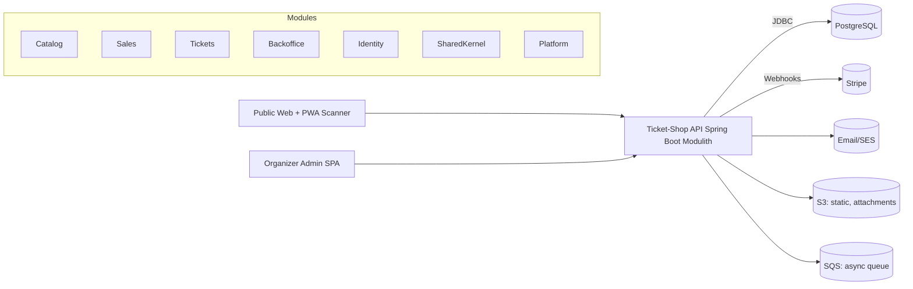
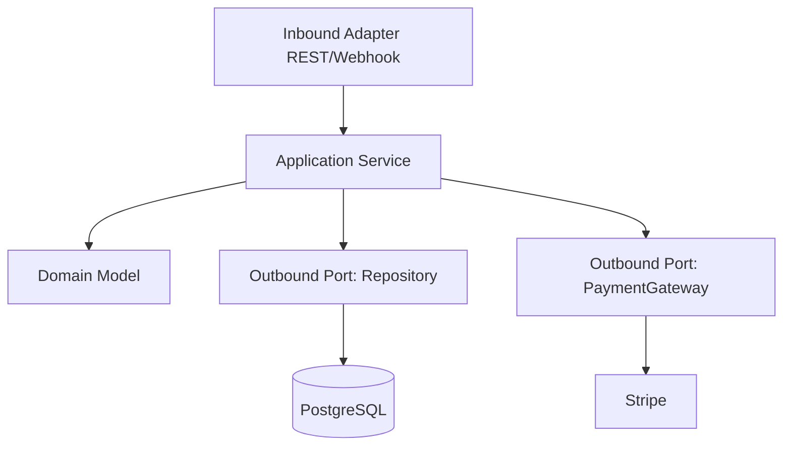
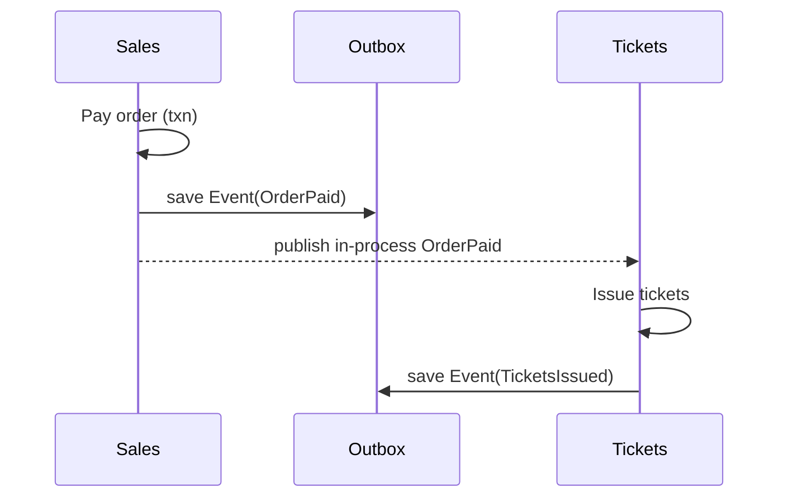
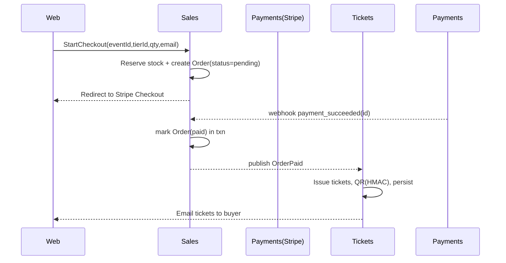
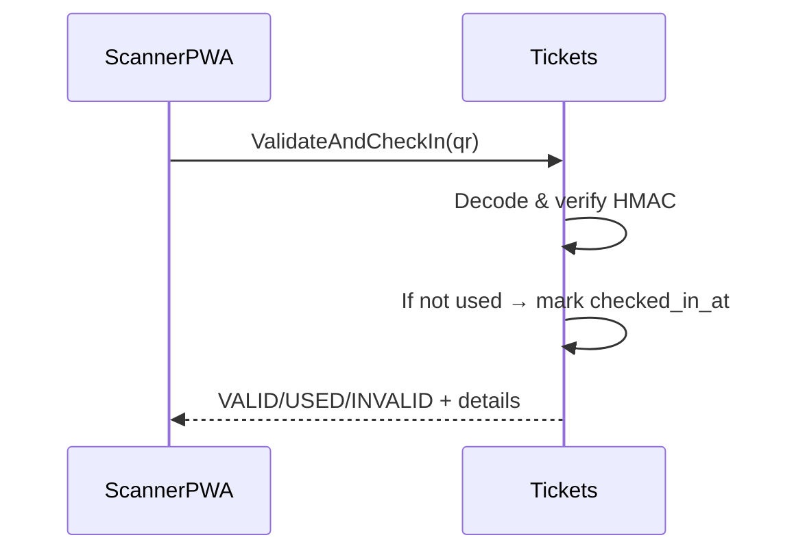
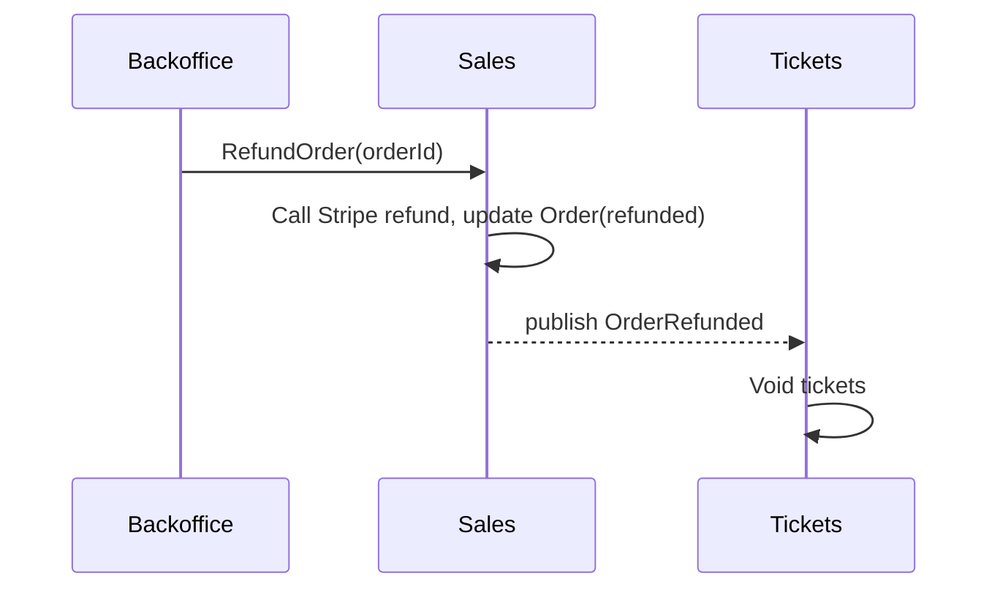
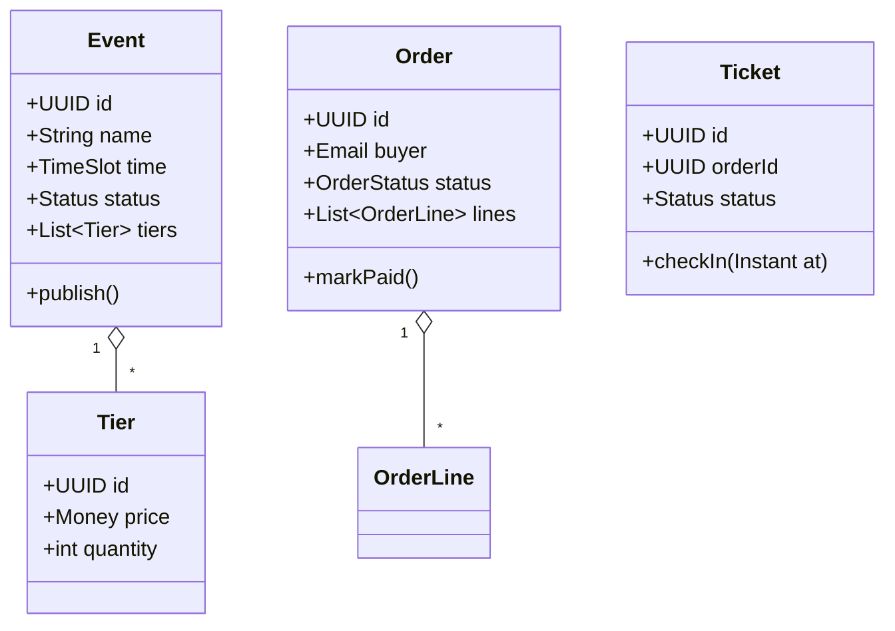

# Ticket-Shop Modulith Architecture (DDD + Hex)

A pragmatic, production-ready Modulith for an event ticketing platform. It keeps teams fast and coherent now, and lets you peel modules into microservices later with minimal pain.

---

## 1) Architectural Overview

**Style:** Domain-Driven Design (DDD) with Hexagonal Architecture inside a **single deployable** (Spring Modulith). Each bounded context is a Spring Modulith *Application Module* with explicit APIs and event publications. Communication across modules is in-process (synchronous) plus **asynchronous domain events** via Spring events (and later via a broker).

**Modules / Bounded Contexts**
- **Catalog** — Events & Ticket Tiers lifecycle (draft → published → closed)
- **Sales** — Checkout, reservations, orders, payments integration
- **Tickets** — Ticket issuance, QR, validation & check-in
- **Backoffice** — Reporting, refunds, CSV exports, organizer dashboards
- **Identity** — Organizer auth, attendee magic links
- **Shared Kernel** — Common primitives (Money, Email, TimeSlot, Uuid), error types
- **Platform** — Cross-cutting adapters (Payments: Stripe; Email: SES/Postmark; Messaging: SQS), Outbox, Observability

**Runtime shape (C4 Container)**


---

## 2) Modulith Module Map

Each module has **domain**, **application**, and **adapters** packages. Only the *application* layer is exported; domain is internal; adapters are private to the module.

```text
com.ticketshop
 ├─ catalog
 │   ├─ domain
 │   ├─ application
 │   └─ adapters
 ├─ sales
 │   ├─ domain
 │   ├─ application
 │   └─ adapters
 ├─ tickets
 │   ├─ domain
 │   ├─ application
 │   └─ adapters
 ├─ backoffice
 │   ├─ domain
 │   ├─ application
 │   └─ adapters
 ├─ identity
 │   ├─ domain
 │   ├─ application
 │   └─ adapters
 ├─ sharedkernel
 └─ platform
     ├─ outbox
     ├─ observability
     └─ config
```

**Visibility rules**
- `application` exposes *use case* services + *facade DTOs*.
- Cross-module access happens only through `application` or via **domain events**.
- `domain` is package-private to its module.
- No adapter calls across modules (avoid adapter-to-adapter coupling).

**Spring Modulith annotations**
- `@ApplicationModule` on each module’s root package.
- `@NamedInterface` on exported application facades.
- `@ApplicationModuleListener` for async reactions to events.

---

## 3) Hexagonal Inside Each Module

**Layers per module**
- **Domain:** Aggregates, Entities, Value Objects, Domain Services, Events.
- **Application:** UseCases (commands/queries), transaction boundaries, orchestration.
- **Adapters:**
  - **Inbound:** REST controllers, webhooks, scheduled jobs.
  - **Outbound:** Repositories (JPA), payments/email gateways, message publisher.



**DTO Policy**
- Commands/Queries use **primitive & VO** fields (no entities). IDs are UUIDs as strings.
- Adapters map HTTP ↔ DTOs. Application returns *read models* shaped for UI.

---

## 4) Bounded Contexts in Detail

### 4.1 Catalog (Events & Tiers)
**Responsibilities**
- Create/Edit events, manage ticket tiers.
- Publish/Close events.
- Emit `EventPublished` when first published.

**Key Aggregates**
- `Event` (owns `TicketTiers`)
- Value Objects: `TimeSlot`, `Money`, `TierId`, `EventId`

**Module API (application)**
- `CreateEvent`, `UpdateEventDetails`, `DefineTicketTier`, `PublishEvent`, `ListPublicEvents`, `GetEventPublic`.

**Tables**
- `catalog.events(id, name, venue, start_at, end_at, status, cover_url)`
- `catalog.tiers(id, event_id, name, price_cents, currency, quantity, sales_start, sales_end)`

**Outbound Ports**
- Repository only.

**Events**
- `EventPublished{eventId}`

---

### 4.2 Sales (Reservations, Orders, Payments)
**Responsibilities**
- Reserve stock, create orders, take payment, manage idempotency.
- Emit `OrderPaid`, `OrderRefunded`, `ReservationExpired`.

**Aggregates**
- `Reservation` (TTL), `Order`
- VOs: `OrderId`, `ReservationId`, `Email`.

**Module API**
- `StartCheckout(eventId, tierId, qty, buyerEmail, buyerName)`
- `ConfirmPayment(providerPayload)` — via webhook
- `RefundOrder(orderId)`

**Tables**
- `sales.reservations(id, event_id, tier_id, qty, buyer_email, expires_at, status)`
- `sales.orders(id, event_id, buyer_email, buyer_name, total_cents, status, payment_ref, created_at)`
- `sales.order_lines(id, order_id, tier_id, qty, price_cents)`

**Outbound Ports**
- `PaymentsGateway`, `ReservationRepository`, `OrderRepository`, `StockLedger`

**Events**
- `OrderPaid{orderId, eventId, lines[]}`
- `OrderRefunded{orderId}`

---

### 4.3 Tickets (Issuance, QR, Check-in)
**Responsibilities**
- Issue tickets for paid orders.
- Generate QR (HMAC).
- Validate & check-in.

**Aggregates**
- `Ticket`
- VO: `TicketId`, `QrPayload`

**Module API**
- `IssueTicketsForOrder(orderId)` — reacts to `OrderPaid`
- `ValidateAndCheckIn(qr)` — idempotent scan
- `VoidTicketsForOrder(orderId)` — reacts to `OrderRefunded`

**Tables**
- `tickets.tickets(id, event_id, tier_id, order_id, serial, qr_payload, status, checked_in_at)`
- Indexes on `(order_id)`, `(event_id, serial)`

**Outbound Ports**
- `TicketRepository`, `QrSigner`, `EmailGateway` (send ticket)

**Events**
- `TicketsIssued{orderId, ticketIds[]}`
- `TicketCheckedIn{ticketId, at}`

---

### 4.4 Backoffice (Reporting, Refunds, Exports)
**Responsibilities**
- Organizer dashboards, CSV exports, initiate refunds via Sales API.
- Read models (materialized views) for speed.

**API**
- `GetEventDashboard(eventId)`
- `ExportSalesCsv(eventId)`
- `RequestRefund(orderId)` → calls `Sales.RefundOrder`

**Storage**
- `backoffice.read_sales(event_id, sold, remaining, checked_in, revenue_cents, ...)` (refreshed by events)

---

### 4.5 Identity
- Organizer accounts, roles.
- Attendee magic link token issuance/verification for viewing tickets.

---

## 5) Cross-Module Communication

**Synchronous calls** (in-process):
- Admin UI → Catalog/Sales Backoffice application facades.

**Asynchronous** (domain events):
- `OrderPaid` → Tickets issues tickets.
- `OrderRefunded` → Tickets voids tickets.
- `TicketCheckedIn` → Backoffice updates KPIs.

In the Modulith, publish Spring events; also persist to **Outbox** so they can be delivered to SQS when you externalize modules.



---

## 6) Key Use-Case Flows

### 6.1 Checkout to Ticket Issuance


### 6.2 Scan & Check-in


### 6.3 Refund


---

## 7) Data Ownership & Schemas

- **Catalog** owns `catalog.*`
- **Sales** owns `sales.*`
- **Tickets** owns `tickets.*`
- **Backoffice** owns **read models** only (can be rebuilt). No business writes here.

Use **schema-per-module** in the same Postgres DB. This eases future DB split.

**DDL sketch** (PostgreSQL)
```sql
create schema catalog;
create table catalog.events(
  id uuid primary key,
  name text not null,
  venue text not null,
  start_at timestamptz not null,
  end_at timestamptz not null,
  status text not null check (status in ('draft','published','closed')),
  cover_url text
);
create table catalog.tiers(
  id uuid primary key,
  event_id uuid not null references catalog.events(id),
  name text not null,
  price_cents int not null,
  currency char(3) not null,
  quantity int not null,
  sales_start timestamptz,
  sales_end timestamptz
);

create schema sales;
create table sales.orders(
  id uuid primary key,
  event_id uuid not null,
  buyer_email text not null,
  buyer_name text not null,
  total_cents int not null,
  status text not null check (status in ('pending','paid','refunded')),
  payment_ref text,
  created_at timestamptz not null default now()
);
create table sales.order_lines(
  id uuid primary key,
  order_id uuid not null references sales.orders(id),
  tier_id uuid not null,
  qty int not null,
  price_cents int not null
);
create table sales.reservations(
  id uuid primary key,
  event_id uuid not null,
  tier_id uuid not null,
  qty int not null,
  buyer_email text not null,
  expires_at timestamptz not null,
  status text not null check (status in ('active','expired'))
);

create schema tickets;
create table tickets.tickets(
  id uuid primary key,
  event_id uuid not null,
  tier_id uuid not null,
  order_id uuid not null,
  serial bigint not null,
  qr_payload text not null,
  status text not null check (status in ('issued','voided','checked_in')),
  checked_in_at timestamptz
);

create schema platform;
create table platform.outbox(
  id bigserial primary key,
  occurred_at timestamptz not null default now(),
  aggregate_id uuid not null,
  type text not null,
  payload jsonb not null,
  published boolean not null default false
);
```

---

## 8) Interfaces & Ports (Examples)

**Sales Application Port (exported)**
```kotlin
interface CheckoutUseCase {
  data class StartCheckoutCommand(
    val eventId: String,
    val tierId: String,
    val qty: Int,
    val buyerEmail: String,
    val buyerName: String
  )
  fun startCheckout(cmd: StartCheckoutCommand): CheckoutRedirect
}
```

**Outbound Port**
```kotlin
interface PaymentsGateway {
  fun createCheckoutSession(orderId: UUID, amountCents: Int, description: String): URL
  fun parseWebhook(signature: String, payload: ByteArray): PaymentEvent
}
```

**Tickets Use Case**
```kotlin
interface ScanUseCase {
  data class ScanCommand(val qr: String)
  fun validateAndCheckIn(cmd: ScanCommand): ScanResult
}
```

---

## 9) REST Endpoints (Inbound Adapters)

- `POST /api/catalog/events` — create
- `POST /api/catalog/events/{id}/publish` — publish
- `GET /api/public/events` — list public
- `GET /api/public/events/{id}` — detail

- `POST /api/checkout/start` — returns Stripe redirect URL
- `POST /api/payments/stripe/webhook` — payment events
- `POST /api/refunds/{orderId}` — request refund

- `POST /api/scan` — validate/check-in
- `GET /api/tickets/{id}` — view ticket (magic link auth)

- `GET /api/backoffice/events/{id}/dashboard` — counters
- `GET /api/backoffice/events/{id}/sales.csv` — export

---

## 10) Testing Strategy (Spring Modulith Friendly)

- **Module slice tests**: `@ApplicationModuleTest` to ensure forbidden dependencies are enforced.
- **Contract tests** for exported application facades (inputs/outputs stable).
- **Domain tests**: pure JVM unit tests (no Spring) for aggregates.
- **Integration tests**: Adapters (Stripe webhook parsing, JPA repos) with Testcontainers Postgres.
- **Scenario tests**: Payment → Tickets issuance sequence with fake gateways.

---

## 11) Observability & Ops

- **Metrics** (Micrometer): `tickets_issued_total`, `checkins_total`, `payment_failures_total`, `reservation_time_ms`.
- **Tracing** (OpenTelemetry): trace inbound HTTP → application use case → outbound ports; propagate Stripe webhook trace.
- **Logging**: structured JSON, `correlation_id` on each request, event IDs in logs.
- **Feature flags**: toggles for offline scanning, overbooking guard, etc.

---

## 12) Security

- Organizer auth via sessions/JWT; roles `ORGANIZER`, `STAFF`.
- Attendee access via **magic links** to view tickets; short-lived signed tokens.
- QR = `base64(ticketId + ":" + hmacSHA256(ticketId, secret))`; server recomputes HMAC.
- Idempotency keys for webhooks and refunds.
- Rate-limit scanner endpoint; show last-scan info.

---

## 13) Migration Path → Microservices (Easy Mode)

**Why this Modulith eases migration**
- Clear module boundaries + NamedInterfaces.
- Schema-per-module in one DB.
- Outbox per domain event.

**Steps**
1. **Externalize messaging**: push Outbox events to SQS (one queue per future service). Keep in-process events for now.
2. **Split read models**: move Backoffice read model refreshers to a worker that consumes SQS.
3. **Carve out Tickets**: run Tickets as a separate service first (needs `/scan` low latency). Share DB initially (or use logical replication). Route events over SQS.
4. **Strangler for Sales**: move Stripe webhook adapter to the Sales service; Modulith calls over HTTP or messaging.
5. **Database split**: move to schema-per-service DBs. Backfill via CDC/replication; cut over with toggles.

**Service boundaries**
- Service 1: Catalog
- Service 2: Sales (Payments)
- Service 3: Tickets (Scanner)
- Service 4: Backoffice (read models only)

---

## 14) Deployment (AWS sketch)

- **API**: ECS Fargate (or Elastic Beanstalk) with ALB
- **DB**: RDS Postgres (Multi-AZ)
- **Static**: S3 + CloudFront (public pages, SPA)
- **Queues**: SQS for async events
- **Email**: SES (or Postmark)
- **Secrets**: AWS Secrets Manager
- **CI/CD**: Build → Test → Dockerize → Migrate (Flyway) → Deploy → Smoke tests

---

## 15) Example Spring Modulith Declarations

```kotlin
// Catalog module API
@NamedInterface
interface PublicCatalogApi {
  fun listPublicEvents(): List<EventSummaryDto>
  fun getEventPublic(id: UUID): EventDetailDto
}

// Module listener (Tickets reacts to Sales)
@ApplicationModuleListener
fun onOrderPaid(event: OrderPaid) {
  ticketIssuer.issueForOrder(event.orderId)
}
```

**Enforce boundaries** with Spring Modulith diagnostics:
- `ApplicationModules.of(TicketShopApplication.class).verify();`

---

## 16) Minimal UML Class Sketch



---

## 17) API Read Models (for speed)

Project read views *inside* Backoffice for fast dashboards. Rebuildable from events.

- `read_sales_by_event(eventId)`
- `read_checkins_by_hour(eventId)`

---

## 18) Door Scanner PWA Contract

- `/api/scan` accepts `{ qr: string }`
- Response: `{ status: 'VALID'|'USED'|'INVALID', attendeeName, tierName, checkedInAt? }`
- Offline mode: cache last N issued tickets (event scope) with ETag; sync diffs on reconnect.

---

## 19) Non-Functional Guardrails

- **Atomic stock reservation** via DB txn (`select ... for update`). TTL sweeper job for `reservations`.
- **Idempotent webhooks** by storing provider event IDs; upsert orders in one txn.
- **Backpressure**: queue scans when DB is slow; respond with 202 + retry token during spikes (optional later).
- **GDPR**: delete PII from tickets after event ends (keep hashed email for fraud stats).

---

## 20) Glossary

- **Aggregate**: cluster of domain objects treated as a unit for data changes.
- **Outbox**: table storing domain events that a relay publishes to external queues.
- **Modulith**: monolith with explicit, testable module boundaries.
- **NamedInterface**: exported API surface of a module (enforced by Spring Modulith).

---

### Appendix A: Migration Checklist
- [ ] Module boundaries pass `ApplicationModules.verify()`
- [ ] Outbox populated for every cross-boundary event
- [ ] Read-model rebuild command exists
- [ ] Feature flags guard remote calls
- [ ] Synthetic load test on `/scan` path

### Appendix B: Local Dev
- Docker Compose: Postgres, LocalStack (SQS/SES), Stripe CLI webhook forwarder.
- Makefile tasks: `make db-up`, `make app`, `make e2e`.

---

**You can start today by scaffolding the module packages and one end-to-end flow (OrderPaid → TicketsIssued).**

